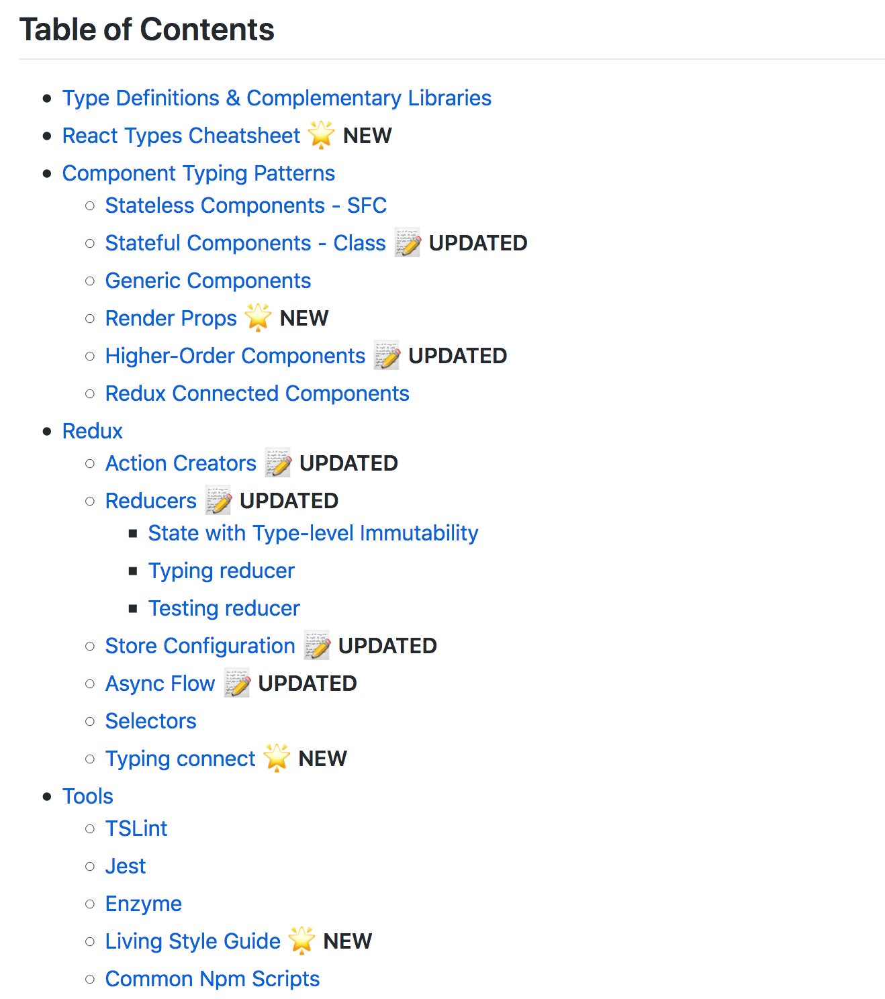

<!-- .slide: data-background="linear-gradient(180deg,#000,#002,#206,rgba(0,0,32,0)), radial-gradient(farthest-side at 50% 120%, rgba(255,0,255,.9), rgba(255,128,255,0))" -->


<!-- .element: style="background: none" -->

Functional-reactive state management <!-- .element: style="color: #fff" -->

<br />
<a style="font-size: 0.7em; vertical-align: middle; color: #fff" href="https://twitter.com/glatteis" target="_blank" class="roll">Sergey Yavnyi / @glatteis</a>

Nov, 2018 <!-- .element: style="color: #fff; font-size: 0.5em" -->

---
Hi, my name is Sergey 👋

* User-facing products @ [Grammarly](https://www.grammarly.com)
* Functional programming + static typing = ❤️

[github.com/blacktaxi](https://github.com/blacktaxi)

---
<!-- .slide: data-background="#fff" -->
<p style="margin: 0px">
  
</p>

<p style="margin: 0px">
  <video
    src="img/product_demo.ogg"
    style="height: 200px"
    preload="auto" autoplay muted loop
  />
</p>

<ul>
  <li>A writing app <em>(grammar, spelling and more!)</em></li>
  <li>Web <em>(+ extensions!)</em>, desktop, mobile</li>
  <li>10M+ active users</li>
</ul>

Note: we do extensions!

---
<!-- .slide: data-background="#fff" -->


# ❤️


<!-- .element: style="box-shadow: none; border: 0px; background: none; height: 150px" -->

_(since 1.8!)_

---
### This talk: Focal

* State management for React
* Immutable state store
* Easy to use
* Type safe

[github.com/grammarly/focal](https://github.com/grammarly/focal)

`npm i -S @grammarly/focal`

---

## Redux?

Note: who's used/using redux?

---

## Redux

⭐️

* [Predictable, consistent state](https://redux.js.org/introduction/threeprinciples)
* [Dev tools](https://github.com/reduxjs/redux-devtools)

❌

* Conciseness (actions, reducers, middleware, async)
* Modularity (`combineReducers`)
* Type safety (you'll need a [guide](https://github.com/piotrwitek/react-redux-typescript-guide))
* Performance (`shouldComponentUpdate`?)

Note: you have probably noticed that redux is not very comfortable to use in TS. many people probably end up using angular or mobx etc for this reason.

---
#### Predictable, consistent state

Worth it.

_...but can we do better?_

---
### Conciseness

`Atom` – the "store"

```typescript
// create the store
const state = Atom.create({ count: 0 })

// update state
state.modify(s => ({ ...s, count: s.count + 1 }))
```

`modify`: _functional update (similar to a reducer)_


Note: modify takes a function similar to a reducer -- it takes current state and supposed to return new value for state

---
### Conciseness

```typescript
type AppState = number
```

Redux

```typescript
type AppAction = { type: 'INC' }

const increment = () => ({ type: 'INC' })

const reducer = (s: AppState, a: AppAction) => {
  switch (a.type) {
    case 'INC': return s + 1

    // ...
  }
}

//...
<button onClick={() => props.dispatch(increment())} />
```

---
Focal

```typescript
//...
<button onClick={() => props.state.modify(s => s + 1)} />
```

Note: no reducer, no action creator, no action type def

---
### Modularity

```typescript
type AppState = { count: number }
```

Note: let's see what happens when the app grows

---
### Modularity

Redux

```typescript
type AppAction = { type: 'INC' }

const increment = () => ({ type: 'INC' })

const reducer = (s: AppState, a: AppAction) => {
  switch (a.type) {
    case 'INC': return { ...s, count: s.count + 1 }

    // ...
  }
}

const mapStateToProps = (state: AppState) => ({
  count: state.count
})

// to be continued...
```

Note: with Redux, 1) update the reducer, 2) mapStateToProps, ...

---
...Redux

```typescript
// ...continued
const Counter = connect(mapStateToProps)(
  (props: {
    count: number; dispatch: (a: AppAction) => void
  }) =>
    <p>
      Value: {props.count}
      <button onClick={() => props.dispatch(increment())} />
    </p>
)

const App = () =>
  <div>
    <Counter />
  </div>

// ...flip over to the next slide 👉
```

Note: ..., 3) connect (+ annotations), ...

---
...Redux

```typescript
// ...continued

render(
  <Provider store={store}>
    <App />
  </Provider>,
  document.getElementById('root')
)

// DONE! 💪
```

Note: ..., 4) Provider

---
### Modularity

Focal

```typescript
const Counter = (props: { count: Atom<number> }) =>
  <F.p>
    Value: {props.count}
    <button onClick={() => props.count.modify(x => x + 1)}/>
  </F.p>

const App = (props: { state: Atom<AppState> }) =>
  <div>
    <Counter count={state.lens('count')} />
  </div>

render(
  <App state={state} />,
  document.getElementById('root')
)

// That's it! 🙌
```

Note: no reducer to update, no mapStateToProps, no global action namespace, redux requires additional effort to componentize your app

---
### `Atom.lens(...)`?

```typescript
// type: Atom<{
//   todos: { items: string[] };
//   counter: { count: number };
// }>
const state = Atom.create({
  todos: {
    items: ['banana']
  },
  counter: {
    count: 0
  }
})
```

Break state into pieces

```typescript
// type: Atom<{ items: string[] }>
const todos = state.lens('todos')

// type: Atom<{ count: number }>
const counter = state.lens('counter')

// type: Atom<number>
const count = counter.lens('count')
```

Note: The lens method creates a "sub-atom", or "sub-store" of the application state store. The returned value is also an atom, which means that this operation can be performed many times, drilling into the state data structure as deeply as needed.

---
<!-- .slide: data-background="#282C33" -->


---
### Lens?

A way to read/write a _part_¹ of immutable data

```typescript
interface Lens<T, U> {
  get(source: T): U // a getter
  set(newValue: U, source: T): T // immutable update
}
```

<br>

¹ – abstractly speaking
<!-- .element: style="font-size: 0.7em" -->

Note: Lens seems to be a very simple idea, but it turns out to be very powerful. By using lenses to operate on immutable state store like Atom we can achieve effortless modularity.

---
```typescript
state.lens('count')
```

...just a short form of

```typescript
state.lens(Lens.create(
  // getter
  (s: AppState) => s.count,
  // setter
  (v, s) => ({ ...s, count: v })
))
```

Note: in our examples, we were using a convenient short form to create lenses, but under the hood it is the same lens interface

---
### Lenses are fun 🔍

📚

* [Program imperatively using Haskell lenses](http://www.haskellforall.com/2013/05/program-imperatively-using-haskell.html)
* [partial.lenses](https://github.com/calmm-js/partial.lenses), [calmm-js](https://github.com/calmm-js/)


Note: lenses come from functional programming and are an indispensable tool when working with immutable data

---
### Type safety

```typescript
const state = Atom.create(
  { counter: { count: 0 }, todos: ['banana'] }
)

const count = state.lens('counter') // ✅ good to go

// [ts] Argument of type '"potato"' is not assignable to
// parameter of type '"counter" | "todos"'.
const potato = state.lens('potato') // ❌ does NOT compile

// [ts] Argument of type '"nope"' is not assignable to
// parameter of type '{ count: number; }'.
counter.set('nope') // ❌ no luck here
```

Auto-completion


Note: need to be careful, write a lot of code and/or use a library to be type safe in Redux

---
### Redux + TS

[github.com/piotrwitek/react-redux-typescript-guide](https://github.com/piotrwitek/react-redux-typescript-guide)



---
### `<F.p>`...?

`F`-components: put `Atom`s in JSX

Subscribe to `Atom`s on mount

```typescript
<F.p onClick={() => state.modify(x => x + 1)}>
  Count: {state}.
</F.p>
```

`Atom.subscribe(...)`

```typescript
state.subscribe(s => {
  // print the app state as it's changing
  console.log('new app state is:', s)
})
```

Note: With redux, you use regular react components and wrap them into a connect + <Provider /> to push the state in. You also have to map state and dispatch functions to props. With Focal, you just pass Atoms to your component. The component can modify the state by directly accessing the Atom. And the Atom's value can be rendered by putting it directly inside of your JSX markup.

---
### Subscribe?

`Atom<T> extends Observable<T>`


<!-- .element: style="background: none; height: 200px" -->

Note: The subscribe method may seem familiar, and it is indeed. Focal is built on top of RxJS. Atoms are observables. Not to be confused with Redux store subscribe.

---
### `Atom` is `Observable`

Can use RxJS operators on `Atom`s

```typescript
state
  .debounceTime(500)
  .subscribe(s => {
    window.localStorage.setItem(
      'appState',
      JSON.stringify(s)
    )
  })
```

Note: Observables can be very powerful and it can be very useful to have it available when working with application state.

---
### RxJS + React

`<F.* />` render `Observable`s

```typescript
<F.div>
  The time is {
    Observable.inverval(1000)
      .startWith(0)
      .map(_ => new Date().toString())
  }.
</F.div>
```

Not just `Atom`s!

Note: Again, power of Observables can be super useful for building UIs. Observables allow declarative control of data flow, which can be delivered straight to your UI markup.

---
### Observables

```typescript
// simplified
interface Observable<T> {
  subscribe(
    onNext: (value: T) => void
  ): { unsubscribe(): void }
}
```

- First class event: _event as value_
- A stream of data: _collection of values over time_

---
### Observables

📚

- [http://queue.acm.org/detail.cfm?id=2169076](http://queue.acm.org/detail.cfm?id=2169076)
  - Your Mouse is a Database
- [https://goo.gl/fQvnzc](https://goo.gl/fQvnzc)
  - Learning Observable By Building Observable
- [http://rxmarbles.com](http://rxmarbles.com)

---
### Performance

~~`shouldComponentUpdate`~~

Note: shouldComponentUpdate rarely, if ever, needed to be implemented with Focal. Since Focal will only render the components for which any of the atom values have changed, it will yield optimal performance out of the box.

---
### Bonus

Can use time-travel debugging!

Note: since redux store and focal atom operate similarly, it is easy to link them and benefit from redux dev tools

---
<!-- .slide: data-background="black" -->


---
<!-- .slide: data-background="black" -->


---
<!-- .slide: data-background="black" -->

<style>
  @keyframes currentZoom {
    0% { transform: scale(1.0); }
    50% { transform: scale(7.0); }
    100% { transform: scale(7.0); }
  }

  @keyframes currentOpacity {
    25% { opacity: 1.0; }
    50% { opacity: 0.0; }
    100% { opacity: 0.0; }
  }

  @keyframes nextZoom {
    0% { transform: scale(0.15); }
    50% { transform: scale(1.0); }
    100% { transform: scale(1.0); }
  }

  @keyframes nextOpacity {
    0% { opacity: 0; }
    40% { opacity: 1.0; }
    100% { opacity: 1.0; }
  }

  .trippyZoom {
    transform-origin: 230px 270px;
    position: absolute;
    left: 80px;
    max-width: none !important;
    max-height: none !important;
    width: 850px;
  }
</style>


---

💻

_It's hacking time!_

[source](https://github.com/blacktaxi/slides/tree/gh-pages/focal-short/demo)

[more examples](https://github.com/grammarly/focal/tree/master/packages/examples)

Note: counter, timer, fractal counter, react perf, redux dev tools, instant search

---
<!-- .slide: data-background="black" -->

# Q & A
<!-- .element: style="color: white" -->

[github.com/grammarly/focal](https://github.com/grammarly/focal)

⚡️

`npm i -S @grammarly/focal`

---
<!-- .slide: data-background="img/east-bay-sunset.jpg" -->

# Weʼre hiring!
<!-- .element: style="color: white" -->

<br />
<br />
<br />

<a href="https://www.grammarly.com/jobs" style="color: white; text-decoration: underline; font-size: 2em">grammarly.com/jobs</a>
