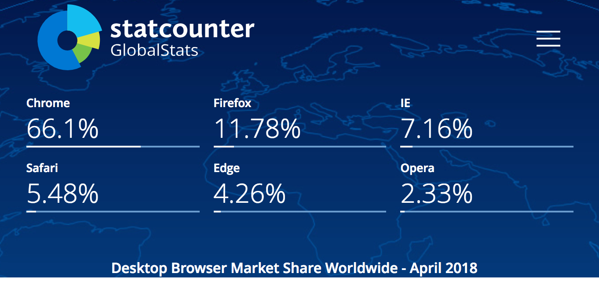

<!-- .slide: data-background="linear-gradient(-45deg, #57c09c, #6cdf98)" -->
## Cross-browser Extension Development <!-- .element: style="color: #fff" -->

Managing complexity of cross-platform code <!-- .element: style="color: #fff" -->

<br />
<a style="font-size: 0.7em; vertical-align: middle; color: #fff" href="https://twitter.com/glatteis" target="_blank" class="roll">Sergey Yavnyi / @glatteis</a>
&nbsp;&nbsp;


May, 2018 <!-- .element: style="color: #fff; font-size: 0.5em" -->

Note: who has shipped an extension? for more than one browser? more than two?

---
About me 👋

* User-facing products @ [Grammarly](https://www.grammarly.com)
* Extensions tech lead, [github.com/grammarly/focal](https://github.com/grammarly/focal)
* Programming (F#, Python, TypeScript, Elm, etc.)
* 10+ yrs, 2+ on the web front-end

[github.com/blacktaxi](https://github.com/blacktaxi), [reversemicrowave.me](http://reversemicrowave.me/)

---
<!-- .slide: data-background="#fff" -->
<p style="margin: 0px">
  
</p>

<p style="margin: 0px">
  <video
    src="img/product_demo.ogg"
    style="height: 200px"
    preload="auto" autoplay="" loop=""
  />
</p>

<ul>
  <li>A writing app <em>(grammar, spelling and more!)</em></li>
  <li>Web, desktop, mobile</li>
  <li>10M+ active users</li>
</ul>

Note: we do extensions!

---
### This talk: cross-browserness

* Why
* Coding side of 'how'

Note: why you might want to do a cross-browser extension, and what's a good way to organize your code around it

---
## Why extensions?

Everywhere you go!

* Inherent value for the user
* Stickiness and retention for your product

Note: people love turbocharging their browser, and as a product it's nice to keep reminding of yourself to your users

---
 <!-- .element: style="height: 77vh; margin: 0px" -->

Note: and you know that people love plug-ins

---
## Cross-browser?

Not when:

* Platform-specific product
* Market fit uncertain
* Limited dev resource

Note: you don't always need to support multiple browsers

---
## However...



Note: no matter how you start, at some point you probably will want to support more than one browser

---
## Why cross-browser?

* User reach
* Availability as value proposition (see 1Password, Evernote, Pocket)

Note: most popular extensions support more than one browser (adblock, 1password, evernote, honey)

---
## No unified platform

JavaScript, HTML, CSS can work differently:
* API surface ([caretPositionFromPoint](https://developer.mozilla.org/en-US/docs/Web/API/DocumentOrShadowRoot/caretPositionFromPoint) vs [caretRangeFromPoint](https://developer.mozilla.org/en-US/docs/Web/API/Document/caretRangeFromPoint))
* Behavior (`fetch` vs `XHR` wr/t `Origin`)
* Rendering (newer CSS features)

[caniuse.com](https://caniuse.com/)

Note: IntersectionObserver not available on Safari, caretRangeFromPoint vs caretPositionFromPoint, HTML5/CSS3 features (Edge, Safari, Firefox, Chrome – all different renderers)

---
### The Web: standardized

* W3C: standards for HTML, CSS, JS
* TC39: standard for ECMAScript

Note: great effort applied to make browsers uniformly standard

---
## Browser extensions

Standards? Not so much.

   

* Chrome: in development, not ready to standardize
* Firefox: [WebExtensions API](https://developer.mozilla.org/en-US/Add-ons/WebExtensions)
* Edge: a mix of WebExtensions and Chrome-like APIs
* Safari: replacing [exclusive API](https://developer.apple.com/library/content/documentation/Tools/Conceptual/SafariExtensionGuide/Introduction/Introduction.html#//apple_ref/doc/uid/TP40009977) with... [exclusive API](https://developer.apple.com/library/content/documentation/NetworkingInternetWeb/Conceptual/SafariAppExtension_PG/index.html)

Note: chrome not interested to standardize, mozilla good citizen, edge new kid on the block trying to fit in, safari – visionary approach – unique

---
<video
  src="img/poot.mp4"
  preload="auto" autoplay loop
/>

Note: learned about safari app extensions

---
### Even on the same browser

* Firefox: XUL vs WebExtensions, Quantum
* Edge: 14 vs 15 (vs 16?)
* Safari: Safari App Extensions

Note: even if you're not dealing with cross-browser support, you might have to deal with differences introduced in new releases. hopefully you never have to deal with this, but if supporting several versions of the same browser is important for you, you'll have to deal with API changes even within a single platform


---
## Different OSes


…

Note: then there are different OSs, which could matter especially if you're making an extension with native calls

---
## Platforms

Browser ✕ Version ✕ OS


Note: from a compatibility point of view all of these are different platforms

---
## Per-platform codebase

_when?_

* Different/separate product
* Very specialized _(e.g. API- or UX-dependent)_

Disadvantages:

* Expensive to develop _(at least N times more as)_
* Product fragmentation

Note: one way to support multiple browsers is to have a separate implementation for each

---
Not a separate product?

Not specialized to platform?

# 👉

Note: at Grammarly, we have a shared codebase

---
## Shared codebase

Advantages:

* Faster, cheaper development

Challenges:

* Growing complexity
* Difficult to add cross-platform support later on


Note: like any cross-platform software, shared codebase has both advantages and disadvantages

---


Note: as been witnessed with C and Java

---
### Example: counting domain visits

Initial Firefox implementation:

```js
function handlePageVisit(domainName) {
  // read user preferences
  browser.storage.local.get('counters').then(storage => {
    const counters = storage.counters || {}
    counters[domainName] = (counters[domainName] || 0) + 1

    // write back the updated count
    browser.storage.local.set({ counters })
  })
}
```

Note: let's start with a hypothetical example of an extension that's supposed to count the number of domain visits. the handlePageVisit function is called when a page is loaded, and it will increment a counter associated with the page address domain. we'll start with Firefox to make it easier, they implement the standard

---
Add Chrome support?

<pre><code data-trim data-noescape class="js">
// code reuse! because why not?
<mark>window.browser = browser || chrome</mark>

function handlePageVisit(domainName) {
  // read user preferences
  browser.storage.local.get('counters').then(storage => {
    const counters = storage.counters || {}
    counters[domainName] = (counters[domainName] || 0) + 1

    // write back the updated count
    browser.storage.local.set({ counters })
  })
}
</code></pre>

Note: now we want to add chrome. we looked at the docs, the api names are the same, it probably will just work, right?

---
Firefox: [returns `Promise`](https://developer.mozilla.org/en-US/Add-ons/WebExtensions/API/storage/StorageArea/get)

vs

Chrome: [takes a callback](https://developer.chrome.com/extensions/storage)


Note: the apis are incompatible, ff uses promise, chrome is callback

---
Add Chrome support:

<pre><code data-trim data-noescape class="js">
function handlePageVisit(domainName) {
  // assume we're on Firefox if `browser` is defined
  <mark>if (typeof browser !== 'undefined') {</mark>
    // read user preferences
    browser.storage.local.get('counters').then(storage => {
      const counters = storage.counters || {}
      counters[domainName] = (counters[domainName] || 0) + 1

      // write back the updated count
      browser.storage.local.set({ counters })
    })
  <mark>} else {</mark>
    // otherwise we're running Chrome
    chrome.storage.local.get('counters', storage => {
      const counters = storage.counters || {}
      counters[domainName] = (counters[domainName] || 0) + 1

      chrome.storage.local.set({ counters })
    })
  }
}
</code></pre>

<!-- .element: style="font-size: 0.45em" -->

Note: so we need different implementations based on which browser we are running

---
Add Chrome support:

<pre><code data-trim data-noescape class="js">
function handlePageVisit(domainName) {
  // assume we're on Firefox if `browser` is defined
  if (typeof browser !== 'undefined') {
    // read user preferences
    browser.storage.local.get('counters').then(storage => {
      <mark>const counters = storage.counters || {}</mark>
      <mark>counters[domainName] = (counters[domainName] || 0) + 1</mark>

      // write back the updated count
      browser.storage.local.set({ counters })
    })
  } else {
    // otherwise we're running Chrome
    chrome.storage.local.get('counters', storage => {
      <mark>const counters = storage.counters || {}</mark>
      <mark>counters[domainName] = (counters[domainName] || 0) + 1</mark>

      chrome.storage.local.set({ counters })
    })
  }
}
</code></pre>

<!-- .element: style="font-size: 0.45em" -->


Note: we now have duplicated the application logic code, let's fix that

---
DRY:

<pre><code data-trim data-noescape class="js">
function handlePageVisit(domainName) {
  const increment = (counters = {}, name) => {
    <mark>counters[name] = (counters[name] || 0) + 1</mark>
    <mark>return counters</mark>
  }

  if (typeof browser !== 'undefined') { // firefox
    browser.storage.local.get('counters').then(storage => {
      browser.storage.local.set({
        counters: <mark>increment(storage.counters, domainName)</mark>
      })
    })
  } else { // chrome
    chrome.storage.local.get('counters', storage => {
      chrome.storage.local.set({
        counters: <mark>increment(storage.counters, domainName)</mark>
      })
    })
  }
}
</code></pre>

<!-- .element: style="font-size: 0.45em" -->


Note: this is an easy fix, we just extract the count increment to a function

---
Propagate errors, return a `Promise`:

<pre><code data-trim data-noescape class="js">
function handlePageVisit(domainName) {
  const increment = (counters = {}, name) => {
    counters[name] = (counters[name] || 0) + 1
    return counters
  }

  if (typeof browser !== 'undefined') { // firefox
    <mark>return</mark> browser.storage.local.get('counters').then(storage => {
      <mark>return</mark> browser.storage.local.set({
        counters: increment(storage.counters, domainName) })
    })
  } else { // chrome
    <mark>return new Promise</mark>(resolve => {
      chrome.storage.local.get('counters', storage => {
        chrome.storage.local.set({
          counters: increment(storage.counters, domainName) }, <mark>resolve</mark>)
      })
    })
  }
}
</code></pre>

<!-- .element: style="font-size: 0.4em" -->


Note: later we find out that we also need to propagate errors, because sometimes the storage API can fail. it also turns out to be asynchronous, and for our UX we might want to indicate when the new count was actually updated, so now we need to return the promise. chrome is callback based, but to keep our sanity we decide to convert it to a promise-based API so that the interface is the same in both cases.

---
Handle errors properly:

<pre><code data-trim data-noescape class="js">
function handlePageVisit(domainName) {
  const increment = (counters = {}, name) => {
    counters[name] = (counters[name] || 0) + 1
    return counters
  }

  if (typeof browser !== 'undefined') { // firefox
    return browser.storage.local.get('counters').then(storage => {
      return browser.storage.local.set({ counters: increment(storage.counters, domainName) })
    })
  } else { // chrome
    return new Promise((resolve, reject) => {
      chrome.storage.local.get('counters', storage => {
        <mark>if (chrome.runtime.lastError)</mark> reject(chrome.runtime.lastError)
        else {
          chrome.storage.local.set({ counters: increment(storage.counters, domainName) }, () => {
            <mark>if (chrome.runtime.lastError)</mark> reject(chrome.runtime.lastError)
            else resolve()
          })
        }
      })
    })
  }
}
</code></pre>

<!-- .element: style="font-size: 0.35em" -->

Note: turns out the proper way to do error checking in chrome is like this

---
Add Safari support:

<pre><code data-trim data-noescape class="js">
function handlePageVisit(domainName) {
  const increment = (counters = {}, name) => {
    counters[name] = (counters[name] || 0) + 1
    return counters
  }

  if (typeof browser !== 'undefined') { // firefox
    return browser.storage.local.get('counters').then(storage => {
      return browser.storage.local.set({ counters: increment(storage.counters, domainName) })
    })
  } else <mark>if (typeof safari !== 'undefined')</mark> { // safari
    return new Promise(resolve => {
      const counters = safari.extension.settings.getItem('counters')
      safari.extension.settings.setItem('counters', increment(counters, domainName))
      resolve()
    })
  } else { // chrome
    return new Promise((resolve, reject) => {
      chrome.storage.local.get('counters', storage => {
        if (chrome.runtime.lastError) reject(chrome.runtime.lastError)
        else {
          chrome.storage.local.set({ counters: increment(storage.counters, domainName) }, () => {
            if (chrome.runtime.lastError) reject(chrome.runtime.lastError)
            else resolve()
          })
        }
      })
    })
  }
}
</code></pre>

<!-- .element: style="font-size: 0.3em" -->

Note: later we decide to add support for safari. by this time you may have noticed that the font size has become so small it is hard to read. that's because there's too much code in this function. as you can see, it's already pretty bad, and we haven't even added Edge support. don't worry, we will not be doing it.

---
[](https://xkcd.com/292/)

Note: so this turned out to be one of those things where you can think that maybe it's not worth your time investing in proper code hygiene, but later you wonder whether it was actually the case

---
Application code mixed with platform code?

## Not scalable

* Unnecessary code complexity (too much noise)
* Hard to maintain (tests are now mixed too)
* Hard to develop (adding new platforms, APIs)
* Hard to test (global dependencies)
* Shipping unreacheable code


Note: code can be hard to follow, tests for platform and application code are the same tests, it's easy to forget to handle a browser when adding new apis or browsers, we call global objects which would have to be patched for testing, which is can be problematic. we're also shipping code that we'll never be ran

---
<pre><code data-trim data-noescape class="js">
function handlePageVisit(domainName) {
  <mark>const increment = (counters = {}, name) => {</mark>
  <mark>  counters[name] = (counters[name] || 0) + 1</mark>
  <mark>  return counters</mark>
  <mark>}</mark>

  if (typeof browser !== 'undefined') { // firefox
    return browser.storage.local.get('counters').then(storage => {
      return browser.storage.local.set({ counters: increment(storage.counters, domainName) })
    })
  } else if (typeof safari !== 'undefined') { // safari
    return new Promise(resolve => {
      const counters = safari.extension.settings.getItem('counters')
      safari.extension.settings.setItem('counters', increment(counters, domainName))
      resolve()
    })
  } else { // chrome
    return new Promise((resolve, reject) => {
      chrome.storage.local.get('counters', storage => {
        if (chrome.runtime.lastError) reject(chrome.runtime.lastError)
        else {
          chrome.storage.local.set({ counters: increment(storage.counters, domainName) }, () => {
            if (chrome.runtime.lastError) reject(chrome.runtime.lastError)
            else resolve()
          })
        }
      })
    })
  }
}
</code></pre>

<!-- .element: style="font-size: 0.3em" -->

Note: of this function's 30 lines of only about 4 represent application logic, the rest is boilerplate

---

<pre><code data-trim data-noescape class="js">
function handlePageVisit(domainName) {
  // actual application logic
  <mark>const increment = (counters = {}, name) => {</mark>
  <mark>  counters[name] = (counters[name] || 0) + 1</mark>
  <mark>  return counters</mark>
  <mark>}</mark>

  // ... platform-specific stuff skipped ...
}
</code></pre>

---
### What can we do?

Separate application and platform code

<br />

**Application**: increment the count

**Platform**: store the counter value


---
# Rule:

## Remove `if`s

_Shift branching from caller to callee_

Note: we're going to move ifs down a level lower from the application code

---
Perfect application logic code:

```js
function handlePageVisit(domainName) {
  // call into our cross-platform API
  return updateStorage('counters', counters => {
    // domain-specific code
    counters[domainName] = (counters[domainName] || 0) + 1
    return counters
  })
}
```

Note: this is how we want our application code to look like – clean and nice

---
Platform: **storage update**

```js
function updateStorage(name, updateFn) {
  if (typeof browser !== 'undefined') { // firefox
    return browser.storage.local.get(name).then(storage => {
      return browser.storage.local.set({ [name]: updateFn(storage[name]) })
    })
  } else if (typeof safari !== 'undefined') { // safari
    return new Promise(resolve => {
      const value = safari.extension.settings.getItem(name)
      safari.extension.settings.setItem(name, updateFn(value))
      resolve()
    })
  } else { // chrome
    return new Promise((resolve, reject) => {
      chrome.storage.local.get(name, storage => {
        if (chrome.runtime.lastError) reject(chrome.runtime.lastError)
        else {
          chrome.storage.local.set({ [name]: updateFn(storage[name]) }, () => {
            if (chrome.runtime.lastError) reject(chrome.runtime.lastError)
            else resolve()
          })
        }
      })
    })
  }
}
```
<!-- .element: style="font-size: 0.38em" -->


Note: this is how we implement a cross-platform API to be used in that function

---
## Not bad!

* ~~Unnecessary code complexity~~ _(solved!)_
* ~~Hard to maintain~~ _(solved! more or less...)_
* Hard to develop (adding new platforms, APIs)
* Hard to test (global dependencies)
* Shipping unreacheable code


but...

Platform-specific code still mixed together

Note: app and platform tests are now separate! (you need platform code tests too!)

---
<pre><code data-trim data-noescape class="js">
function updateStorage(name, updateFn) {
  <mark>if</mark> (typeof browser !== 'undefined') { // <mark>firefox</mark>
    return browser.storage.local.get(name).then(storage => {
      return browser.storage.local.set({ [name]: updateFn(storage[name]) })
    })
  } <mark>else if</mark> (typeof safari !== 'undefined') { // <mark>safari</mark>
    return new Promise(resolve => {
      const value = safari.extension.settings.getItem(name)
      safari.extension.settings.setItem(name, updateFn(value))
      resolve()
    })
  } <mark>else</mark> { // <mark>chrome</mark>
    return new Promise((resolve, reject) => {
      chrome.storage.local.get(name, storage => {
        if (chrome.runtime.lastError) reject(chrome.runtime.lastError)
        else {
          chrome.storage.local.set({ [name]: updateFn(storage[name]) }, () => {
            if (chrome.runtime.lastError) reject(chrome.runtime.lastError)
            else resolve()
          })
        }
      })
    })
  }
}
</code></pre>

<!-- .element: style="font-size: 0.38em" -->


Note: our cross-platform API implementation is separated from application code, but inside it still refers to all of the platforms that we support.

---
### What can we do?

Separate platform-specific implementations

<br />

 `browser.storage.local`

 `chrome.storage.local`

 `safari.extension.settings`

---
## Remove `if`s

---

`api/firefox.js`:
```
export function updateStorage(name, updateFn) {
  // ... use browser.storage.local ...
}
```

`api/chrome.js`:
```
export function updateStorage(name, updateFn) {
  // ... use chrome.storage.local ...
}
```

`api/safari.js`:
```
export function updateStorage(name, updateFn) {
  // ... use safari.extension.settings ...
}
```

Note: create a separate module for each platform implementation

---
`app.js`:
```
import * as firefoxApi from './api/firefox'
import * as chromeApi from './api/chrome'
import * as safariApi from './api/safari'

let api
if (typeof browser !== 'undefined') api = firefoxApi
else if (typeof safari !== 'undefined') api = safariApi
else api = chromeApi

function handlePageVisit(domainName) {
  // call into our cross-platform API
  return api.updateStorage('counters', counters => {
    // domain-specific code
    counters[domainName] = (counters[domainName] || 0) + 1
    return counters
  })
}
```

Note: choose particular implementation based on which browser we are running on

---
## Better

* ~~Unnecessary code complexity~~
* ~~Hard to maintain~~
* ~~Hard to develop~~ _(fixed!)_
* Hard to test (global dependencies)
* Shipping unreacheable code

---
```js
import * as firefoxApi from './api/firefox'
import * as chromeApi from './api/chrome'
import * as safariApi from './api/safari'

let api
if (typeof browser !== 'undefined') api = firefoxApi
else if (typeof safari !== 'undefined') api = safariApi
else api = chromeApi
```

* Global reference to the API
* Importing all of the API implementations

---
## Remove `if`s

---
## Remove `if`s

* Inject the API dependency
* Separate entry point for each platform

---
`app.js`:
<pre><code data-trim data-noescape class="js">
export class App {
  constructor(<mark>api</mark>) {
    <mark>this.api</mark> = api
  }

  // ...
  handlePageVisit(domainName) {
    // call into our cross-platform API
    return <mark>this.api</mark>.updateStorage('counters', counters => {
      // domain-specific code
      counters[domainName] = (counters[domainName] || 0) + 1
      return counters
    })
  }
}
</code></pre>


Note: convert our application into a class which takes the cross-platform api implementation as a constructor argument

---
`firefox.js`:
<pre><code data-trim data-noescape class="js">
import { <mark>FirefoxApi</mark> } from './api/<mark>firefox</mark>'
import { App } from './app'

const app = new App(new <mark>FirefoxApi</mark>())
app.run()
</code></pre>

`chrome.js`:
<pre><code data-trim data-noescape class="js">
import { <mark>ChromeApi</mark> } from './api/<mark>chrome</mark>'
import { App } from './app'

const app = new App(new <mark>ChromeApi</mark>())
app.run()
</code></pre>

`safari.js`:
<pre><code data-trim data-noescape class="js">
import { <mark>SafariApi</mark> } from './api/<mark>safari</mark>'
import { App } from './app'

const app = new App(new <mark>SafariApi</mark>())
app.run()
</code></pre>


Note: and these would be our separate entry points, one for each browser

---
## ✨ Done! ✨

* ~~Unnecessary code complexity~~
* ~~Hard to maintain~~
* ~~Hard to develop~~
* ~~Hard to test~~
* ~~Shipping unreacheable code~~

---
## Getting rid of `if`s

Linear (`if`less) code is easier to work with¹

---
### ¹Not all `if`s are bad

* Don't overdo it: in many cases an `if` is simpler
  * e.g. browser logo image in UI
* Make a judgement call

> Do I make my code less or more complex by removing this `if`?

---
## Red flags <!-- .element: style="color: red" -->

* `if (browser) ...`
* `if (background) ...`

---
### More `if`s to remove?

Depends.

---
## Cross-context code sharing

* Does your extension have both background page and content scripts?
* Do you try to reuse code accross those?

<br />

_They are different execution contexts!_

---
## Context differences

* Different API surface
* Different behavior
* Not just extension APIs

---
[`browser.storage.get`](https://developer.mozilla.org/en-US/Add-ons/WebExtensions/API/storage/StorageArea/get)


---
Trying to run content script code on background page?

#### ❌ Don't do it:

```js
function fetchCounters() {
  // need to be on background page for correct
  // Origin header
  if (background) { // 👈 bad
    return fetch('https://visitcounter.com/api/counters')
  } else {
    // will use messaging to forward the call to background
    // page
    return api.callBg('fetchCounters')
  }
}
```

---
### Mixing code from accross contexts

Same issues:

* Added complexity
* Hard to maintain/develop/test
* Shipping unreacheable code

---
### Solution?

* Remove `if`s, put it in the API layer.
* Watch your bundle (e.g. [webpack-bundle-analyzer](https://www.npmjs.com/package/webpack-bundle-analyzer))

Note: true story, we once accidentally bundled React into our background page because of indirect import

---
### What we did

* Separate application and platform code
* Separate entry points for each platform
* Separate entry points for each context
* Unified cross-platform API interface
* Modular, testable architecture

---
 <!-- .element: style="margin: 0px; height: 77vh" -->

---
 <!-- .element: style="margin: 0px; height: 77vh" -->

---
 <!-- .element: style="margin: 0px; height: 77vh" -->

---
### Already exists?

[Introducing OpenForge (2013)](http://trigger.io/cross-platform-application-development-blog/2013/09/10/introducing-openforge-an-open-source-cross-platform-browser-add-on-framework/)


[github.com/trigger-corp/browser-extensions](https://github.com/trigger-corp/browser-extensions)

Note: we used OpenForge for some time, not anymore. does anybody use a similar framework/library?

---
### Not anymore

* Not maintained
* Complicated build process
* Questionable architecture

```
if (background) {
  // background page code
} else {
  // content script code
}
```

Note: need python to build, hard to maintain, not a good architecture

---
### API design guidelines

* Implement for both extension and general JS
* Sufficiently high-level _(hide complexity)_
* Uniform _(least common denominator)_
* Custom-tailored _(special, not general purpose)_
* Only necessary APIs _(don't do what you don't need)_
* Modular _(no globals, no implicit effects)_

Note: hide complexity – application code has complexity of its own

---
### Further improvements

Use static typing (we use [TypeScript](http://www.typescriptlang.org))

* Easier to enforce the architecture

_Bonus:_

* Tests that you don't have to write
* Documentation that stays up to date
* Code intent expressed more clearly

---
### Static typing is cool

* [https://jaredforsyth.com/type-systems-js-dev/](https://jaredforsyth.com/type-systems-js-dev/)

  Type systems will make you a better JavaScript programmer
* [https://goo.gl/jkHcSQ](https://goo.gl/jkHcSQ)

  Designing with types: Making illegal states unrepresentable (F#)

---
## Conclusion

   

* Design for cross-platform from the start
  * Good design will scale _(even with one platform)_
* Follow good practices
  * Separate concerns and try to keep code simple
* Embrace the tools
  * Compiler is your friend

Note: good practices – no top level side effects

---
<!-- .slide: data-background="black" -->

# Q & A

<!-- .element: style="color: white" -->

---
<!-- .slide: data-background="img/gargantua.jpg" -->

# Weʼre hiring!

<!-- .element: style="color: white" -->

<br />
<br />
<br />

<a href="https://www.grammarly.com/jobs" style="color: white; text-decoration: underline; font-size: 2em">grammarly.com/jobs</a>
